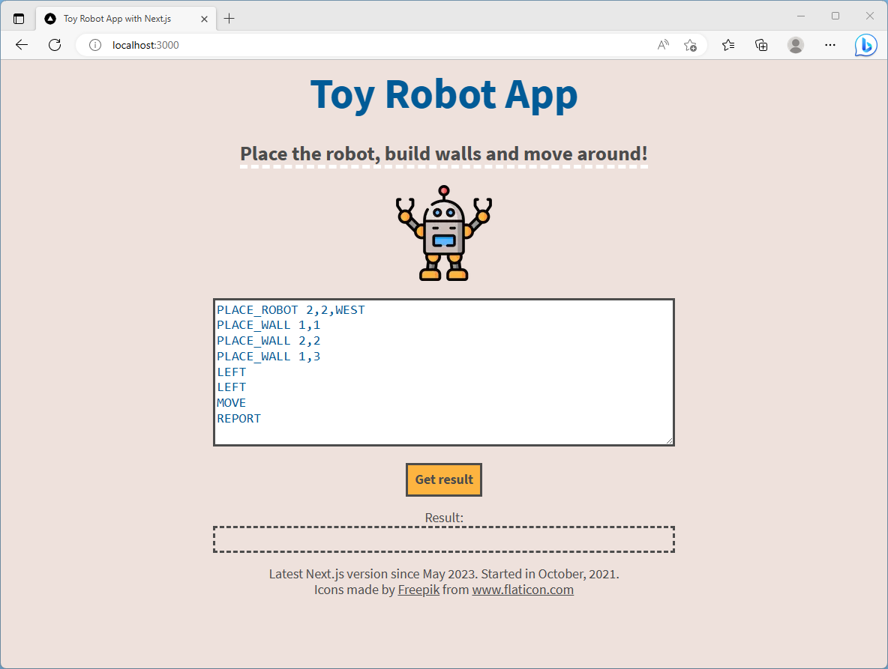

# Toy Robot Game

This is a Next.js version of an older pet project. I made this in Next.js and functional components, because the old version's Create React App part was deprecated, and was also an older implementation with classes.

## Available Scripts

Run these
1. `npm install`
2. `npm run build`
3. `npm run dev`

## Screenshot

The app looks like this.



## License

Please read [the license file.](LICENSE)

## Project description

We use this test as an indication of the kind of code that a candidate would write on a day to day basis, so please take your time and submit representative code.

Please read the requirements carefully.

Important

You should aim to deliver production ready code, and your repository should be structured as you would if you were setting up a real repository.

- Please use Git to track your changes, after you have completed, upload your code to GitHub and share the URL with us. Complete Git commit history must be present.
- You must use React and JavaScript/TypeScript to complete the exercise and demonstrate your React and core JavaScript fundamental knowledge.
- Unit tests must be included, you can choose any testing library.
- You may choose how the application handles user inputs / commands using but not limited to:
    - a text input
    - a text area
    - implement buttons to perform each command.

## Requirements

You are tasked to implement a simple Toy Robot game.

The game initialises with an empty 5 x 5 board with its own coordinate system: the bottom left of the board is (1, 1) (row 1, column 1), and the top right corner of the board is (5, 5).

When the game starts, it responds to the following user commands: PLACE_ROBOT ROW,COL,FACING

This command places a robot at a given coordinate with an initial Facing direction

- If there are no robots on the board, the PLACE_ROBOT adds one to the coordinate specified.
- If there is already a robot, a new PLACE_ROBOT command moves the existing robot to the new location.
- If the coordinate or facing value is invalid, then the game ignores it and does nothing.

Accepted Facing values are: NORTH, SOUTH, EAST, WEST

Example

```
# This places a robot at row 2, column 3, facing North.
PLACE_ROBOT 2,3,NORTH

# This command is ignored because facing direction is invalid
PLACE_ROBOT 2,3,CENTER

# This command is ignored because the COL coordinate is invalid
PLACE_ROBOT 2,6,EAST
```

## PLACE_WALL ROW,COL

This command places a wall at the given coordinate.

- If the target location is empty, then it adds a wall to it.
- The user can add as many walls as they like until the board is filled.
- If the target location is occupied (by the robot, or another wall), then this command is ignored.
- Invalid coordinates are ignored.

Example

```
# This places a wall at row 2, column 3.
PLACE_WALL 2,3
```
## REPORT

The game prints out the current location and facing direction of the robot.

If there are no robots on the board, this command is ignored.

Example

```
PLACE_ROBOT 2,3,WEST
REPORT
# -> app prints: 2,3,WEST
```

## MOVE

The MOVE command moves the robot 1 space forward in the direction it is currently facing.

- If there are no robots on the board, this command is ignored.
- If there is a wall in front of the robot, this command is ignored.
- If the robot has already reached the edge of the board, a MOVE command towards the edge warps the robot to the opposite of the board.

Example

```
# robot starts at 1,1 facing North
PLACE_ROBOT 1,1,NORTH
# a single move
MOVE
# report location
REPORT
# -> app prints: 1,2,NORTH

# robot starts at 1,1 facing SOUTH
PLACE_ROBOT 1,1,SOUTH

# a single move towards the edge MOVE
# report location
REPORT
# -> app prints: 1,5,SOUTH
# The robot is moved to the opposite side, facing the same direction.
```

## LEFT / RIGHT

The turn commands LEFT and RIGHT, turns the robot 90 degrees to its current left or right.

If there are no robots on the board, this command is ignored.

Example

```
PLACE_ROBOT 1,1,NORTH
LEFT
REPORT
# -> app prints: 1,1,WEST
RIGHT
REPORT
# -> app prints: 1,1,NORTH
```

## Test Data

Here are some examples of test data to help your development:

```
PLACE_ROBOT 3,3,NORTH
PLACE_WALL 3,5
MOVE
MOVE
RIGHT
MOVE
MOVE
MOVE
REPORT
# the app should print: 1,4,EAST
```

```
PLACE_ROBOT 2,2,WEST
PLACE_WALL 1,1
PLACE_WALL 2,2
PLACE_WALL 1,3
LEFT
LEFT
MOVE
REPORT
# the app should print: 2,3,EAST
```
